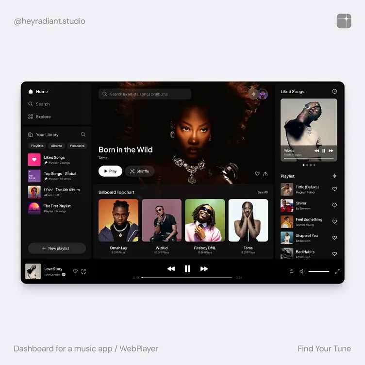

{
  "owner": "solana563",
  "repo": "MYLO-Music",
  "branch": "feat/high-tech-audio-architecture",
  "files": [
    {
      "path": "README.md",
      "content": "# MYLO – My Music. My Way.\n\n<div align=\"center\">\n\n\n\n**A beautiful, feature-rich offline music player for desktop, tablet, and mobile devices.**\n\n[](https://opensource.org/licenses/MIT)\n[](https://react.dev)\n[](https://www.typescriptlang.org)\n[](https://web.dev/progressive-web-apps)\n\n[Features](#features) • [Installation](#installation) • [Architecture](#architecture) • [Development](#development) • [Contributing](#contributing)\n\n</div>\n\n---\n\n## Overview\n\n**MYLO** is a modern, open-source offline music player that puts **you** in control. No cloud streaming, no algorithm surprises—just your music, your way. Perfect for local libraries, privacy-conscious listeners, and anyone who wants a beautiful, responsive music experience across all devices.\n\n### Why MYLO?\n\n✨ **Completely Offline** – Play your entire music library without internet  \n🎵 **Advanced Audio** – Gapless playback, 10-band EQ, spatial audio profiles  \n🧠 **Smart Features** – Predictive recommendations, automatic queuing, analytics  \n📱 **Cross-Platform** – Responsive design works on mobile, tablet, and desktop  \n⚡ **Blazingly Fast** – Local-first architecture with zero loading delays  \n🔐 **Private** – All data stays on your device; no telemetry or tracking  \n📥 **Installable** – Install as a native app (PWA) on any device  \n\n---\n\n## Features\n\n### 🎧 Professional Audio Engine\n\n#### Gapless Crossfade Engine\n- True seamless playback between tracks\n- Customizable crossfade duration (1–12 seconds)\n- Advanced easing curves: Linear, Exponential, Ease-In, Ease-Out\n- Precise decibel ramp calculations for audio quality\n\n#### Advanced 10-Band Equalizer\n- 6 professionally-tuned presets:\n  - **Flat** – Reference sound (no EQ)\n  - **Bass Boost** – Emphasize low frequencies\n  - **Treble Boost** – Crystal-clear highs\n  - **Vocal Boost** – Bring vocals forward\n  - **Hip Hop** – Optimized for hip-hop & rap\n  - **Classical** – Smooth & refined sound\n- Real-time band adjustment (±12 dB)\n- Custom preset saving\n\n#### Spatial Audio & Reverb Profiles\n- **Small Room** – Intimate, detailed acoustics\n- **Concert Hall** – Spacious, grand sound\n- **Studio** – Professional, clean recording\n- **Cathedral** – Majestic, reverberant space\n- **Live Venue** – Energy of live performance\n\n### 🎯 Smart Queuing & Discovery\n\n#### Dynamic Autoplay\n- Analyzes currently playing track\n- Generates intelligent next-track recommendations based on:\n  - Genre matching\n  - BPM proximity (within tolerance)\n  - Acoustic features (energy, danceability, valence)\n  - Artist variety\n  - Unplayed track prioritization\n\n#### Predictive Analytics\n- **7-Day Trend Analysis** – Track skip rate, session duration, like rate\n- **Churn Risk Prediction** – Identify declining engagement patterns\n- **Personalized Recommendations** – \"Refresh Your Sound\" when you skip too much\n- **Local Analytics** – All calculations on-device; zero cloud dependency\n\n### 📊 Advanced Features\n\n#### Waveform Visualization\n- Real-time audio buffer analysis\n- Interactive seek bar with waveform display\n- Color-coded intensity based on energy density\n- Smooth quadratic curve rendering\n\n#### Library Management\n- **Duplicate Detection** – SHA-256 hashing to find exact duplicates\n- **Low-Quality Detection** – Alerts for files under 128 kbps\n- **Metadata Editor** – Edit ID3 tags and acoustic features\n- **Folder Monitoring** – Auto-detect new files in library folders\n- **Import/Export** – Backup and restore library as JSON\n\n#### Synced Lyrics\n- LRC format support (`[00:12.34]Lyric text`)\n- Interactive sync editor with timeline stamping\n- Embed lyrics into file metadata\n- Real-time lyric display during playback\n\n### 📱 Cross-Platform & Responsive\n\n#### Desktop Experience\n- Multi-panel layout (sidebar + main content + right panel)\n- 4–6 column grid for album browsing\n- Full-size player with advanced controls\n\n#### Tablet Experience\n- Balanced 3–4 column layout\n- Touch-optimized controls (48×48px minimum)\n- Landscape & portrait support\n\n#### Mobile Experience\n- Single-column, compact layout\n- Floating player bar\n- Gesture-friendly navigation\n- Notch & safe area support\n\n### 🔋 Offline-First Architecture\n\n#### IndexedDB Storage\n- Track metadata & acoustics\n- Play history & statistics\n- User preferences & settings\n- Library folder permissions\n\n#### Service Worker\n- Automatic offline caching\n- Network fallback strategies\n- Zero connectivity required\n\n#### PWA Installation\n- Install to home screen (iOS & Android)\n- Native app experience\n- File handler integration\n- Share target API support\n\n---\n\n## Installation\n\n### Prerequisites\n- **Node.js** 18+ or **pnpm** 8+\n- Modern browser with Web Audio API support\n\n### Quick Start\n\n```bash\n# Clone the repository\ngit clone https://github.com/solana563/MYLO-Music.git\ncd MYLO-Music\n\n# Install dependencies\npnpm install\n\n# Start development server\npnpm dev\n\n# Build for production\npnpm build\n```\n\nThen open [http://localhost:5173](http://localhost:5173) in your browser.\n\n### Installation as PWA\n\n1. Open MYLO in your browser\n2. Look for the \"Install\" prompt (desktop/mobile)\n3. Click \"Install\" to add to your home screen\n4. Works offline immediately\n\n---\n\n## Architecture\n\n### Project Structure\n\n```\nsrc/\n├── app/\n│   ├── components/\n│   │   ├── MusicPlayer.tsx         # Main player UI\n│   │   ├── OfflineComponents.tsx    # Offline UI & library tools\n│   │   ├── PWAInstallPrompt.tsx     # Installation prompt\n│   │   └── DeviceDebugInfo.tsx      # Debug info overlay\n│   ├── hooks/\n│   │   ├── useAudioEngine.ts        # Audio processing hook\n│   │   ├── useDeviceInfo.ts         # Device detection\n│   │   ├── useResponsiveLayout.ts   # Adaptive layouts\n│   │   ├── useTouchDetection.ts     # Touch & hover detection\n│   │   └── useOfflineSync.ts        # Offline state tracking\n│   ├── services/\n│   │   ├── audioEngine.ts           # Gapless crossfade\n│   │   ├── smartQueuing.ts          # Auto-queue recommendations\n│   │   ├── advancedEqualizer.ts     # 10-band EQ & spatial audio\n│   │   ├── predictiveAnalytics.ts   # Engagement tracking\n│   │   ├── waveformGenerator.ts     # Waveform visualization\n│   │   ├── libraryScanner.ts        # File system scanning\n│   │   └── lyricsSync.ts            # LRC lyrics editor\n│   ├── db/\n│   │   ├── database.ts              # IndexedDB schema\n│   │   ├── localStorageManager.ts   # Data operations\n│   │   └── fileSystemManager.ts     # File system API\n│   └── App.tsx                      # Root component\n├── styles/\n│   ├── index.css                    # Global styles\n│   └── responsive.css               # Responsive design\n└── main.tsx                         # Entry point\n\npublic/\n├── manifest.json                    # PWA manifest\n├── sw.ts                            # Service Worker\n└── index.html                       # HTML shell\n```\n\n### Technology Stack\n\n| Layer | Technology |\n|-------|------------|\n| **Frontend** | React 18 + TypeScript |\n| **Styling** | Tailwind CSS 4 + PostCSS |\n| **Build** | Vite 6 |\n| **Audio** | Web Audio API |\n| **Storage** | IndexedDB (Dexie) |\n| **UI Components** | Radix UI + shadcn/ui |\n| **Icons** | Lucide React |\n| **Forms** | React Hook Form |\n| **Routing** | React Router 7 |\n| **Animations** | Motion |\n\n---\n\n## Development\n\n### Available Scripts\n\n```bash\n# Development server with hot reload\npnpm dev\n\n# Production build\npnpm build\n\n# Type checking\npnpm type-check\n```\n\n### Key Hooks & Utilities\n\n#### Device Detection\n```typescript\nimport { useDeviceInfo } from './hooks/useDeviceInfo';\n\nconst device = useDeviceInfo();\nif (device.isMobile) {\n  // Mobile-specific logic\n}\n```\n\n#### Responsive Layouts\n```typescript\nimport { useResponsiveLayout } from './hooks/useResponsiveLayout';\n\nconst layout = useResponsiveLayout();\nconst gridCols = layout.gridColumns; // 1-6 based on device\n```\n\n#### Audio Engine\n```typescript\nimport { useAudioEngine } from './hooks/useAudioEngine';\n\nconst audio = useAudioEngine();\nawait audio.generateWaveform(audioBuffer);\naudio.applyEqualizerPreset('bass_boost');\naudio.configureCrossfade({ duration: 5, enabled: true });\n```\n\n#### Local Storage\n```typescript\nimport LocalStorageManager from './db/localStorageManager';\n\nconst manager = new LocalStorageManager();\nawait manager.addOrUpdateTrack(trackMetadata);\nconst liked = await manager.getLikedTracks();\nconst json = await manager.exportLibrary();\n```\n\n---\n\n## Browser Support\n\n| Browser | Desktop | Mobile |\n|---------|---------|--------|\n| **Chrome/Edge** | ✅ v90+ | ✅ v90+ |\n| **Firefox** | ✅ v88+ | ✅ v88+ |\n| **Safari** | ✅ v14+ | ✅ v14+ |\n| **Opera** | ✅ v76+ | ✅ v76+ |\n\n**Requirements:**\n- Web Audio API support\n- IndexedDB support\n- Service Workers support\n- File System Access API (optional, for folder browsing)\n\n---\n\n## Audio Format Support\n\n✅ **Natively Supported** (via browser)\n- MP3\n- WAV\n- AAC\n- OGG\n- WebM\n\n⚠️ **Limited Support**\n- FLAC (via external codec)\n- M4A (Safari only)\n\n---\n\n## Performance\n\n- **Bundle Size**: ~250 KB (gzipped)\n- **First Load**: < 2 seconds\n- **Offline**: Instant load\n- **Memory**: < 100 MB (typical)\n- **CPU**: < 5% at idle\n\n---\n\n## Roadmap\n\n- [ ] Playlist creation & management\n- [ ] Folder-based organization\n- [ ] Search with filters & sorting\n- [ ] Album art extraction & display\n- [ ] Tag cloud visualization\n- [ ] Batch metadata editing\n- [ ] Audio fingerprinting for duplicates\n- [ ] Lyrics search & fetching\n- [ ] Desktop app (Electron)\n- [ ] Multi-device sync (optional cloud)\n\n---\n\n## Privacy & Data\n\n🔐 **Your data is yours:**\n- All music stays on your device\n- No internet connection required\n- No user tracking or analytics sent to servers\n- No ads or sponsored content\n- Export your library anytime\n\n---\n\n## Contributing\n\nContributions are welcome! Please follow these steps:\n\n1. Fork the repository\n2. Create a feature branch (`git checkout -b feature/amazing-feature`)\n3. Commit your changes (`git commit -m 'Add amazing feature'`)\n4. Push to the branch (`git push origin feature/amazing-feature`)\n5. Open a Pull Request\n\n### Development Guidelines\n- Write TypeScript with strict mode\n- Follow React best practices\n- Use meaningful commit messages\n- Test responsive behavior on multiple devices\n- Document new features in README\n\n---\n\n## License\n\nMIT License – See [LICENSE](./LICENSE) file for details.\n\n---\n\n## Acknowledgments\n\n- **Inspiration**: Spotify, Plex, Local media players\n- **UI Components**: [shadcn/ui](https://ui.shadcn.com), [Radix UI](https://www.radix-ui.com)\n- **Icons**: [Lucide](https://lucide.dev)\n- **Audio**: [Web Audio API](https://developer.mozilla.org/en-US/docs/Web/API/Web_Audio_API)\n\n---\n\n<div align=\"center\">\n\n**Made with ❤️ by the MYLO community**\n\n[Star on GitHub](https://github.com/solana563/MYLO-Music) • [Report an Issue](https://github.com/solana563/MYLO-Music/issues) • [Discussions](https://github.com/solana563/MYLO-Music/discussions)\n\n</div>\n"
    },
    {
      "path": "package.json",
      "content": "{\n  \"name\": \"mylo\",\n  \"displayName\": \"MYLO – My Music. My Way.\",\n  \"description\": \"A beautiful, feature-rich offline music player for desktop, tablet, and mobile devices.\",\n  \"private\": true,\n  \"version\": \"1.0.0\",\n  \"type\": \"module\",\n  \"author\": \"solana563\",\n  \"license\": \"MIT\",\n  \"repository\": {\n    \"type\": \"git\",\n    \"url\": \"https://github.com/solana563/MYLO-Music.git\"\n  },\n  \"scripts\": {\n    \"build\": \"vite build\",\n    \"dev\": \"vite\",\n    \"preview\": \"vite preview\",\n    \"type-check\": \"tsc --noEmit\"\n  },\n  \"dependencies\": {\n    \"@emotion/react\": \"11.14.0\",\n    \"@emotion/styled\": \"11.14.1\",\n    \"@mui/icons-material\": \"7.3.5\",\n    \"@mui/material\": \"7.3.5\",\n    \"@popperjs/core\": \"2.11.8\",\n    \"@radix-ui/react-accordion\": \"1.2.3\",\n    \"@radix-ui/react-alert-dialog\": \"1.1.6\",\n    \"@radix-ui/react-aspect-ratio\": \"1.1.2\",\n    \"@radix-ui/react-avatar\": \"1.1.3\",\n    \"@radix-ui/react-checkbox\": \"1.1.4\",\n    \"@radix-ui/react-collapsible\": \"1.1.3\",\n    \"@radix-ui/react-context-menu\": \"2.2.6\",\n    \"@radix-ui/react-dialog\": \"1.1.6\",\n    \"@radix-ui/react-dropdown-menu\": \"2.1.6\",\n    \"@radix-ui/react-hover-card\": \"1.1.6\",\n    \"@radix-ui/react-label\": \"2.1.2\",\n    \"@radix-ui/react-menubar\": \"1.1.6\",\n    \"@radix-ui/react-navigation-menu\": \"1.2.5\",\n    \"@radix-ui/react-popover\": \"1.1.6\",\n    \"@radix-ui/react-progress\": \"1.1.2\",\n    \"@radix-ui/react-radio-group\": \"1.2.3\",\n    \"@radix-ui/react-scroll-area\": \"1.2.3\",\n    \"@radix-ui/react-select\": \"2.1.6\",\n    \"@radix-ui/react-separator\": \"1.1.2\",\n    \"@radix-ui/react-slider\": \"1.2.3\",\n    \"@radix-ui/react-slot\": \"1.1.2\",\n    \"@radix-ui/react-switch\": \"1.1.3\",\n    \"@radix-ui/react-tabs\": \"1.1.3\",\n    \"@radix-ui/react-toggle-group\": \"1.1.2\",\n    \"@radix-ui/react-toggle\": \"1.1.2\",\n    \"@radix-ui/react-tooltip\": \"1.1.8\",\n    \"canvas-confetti\": \"1.9.4\",\n    \"class-variance-authority\": \"0.7.1\",\n    \"clsx\": \"2.1.1\",\n    \"cmdk\": \"1.1.1\",\n    \"date-fns\": \"3.6.0\",\n    \"dexie\": \"^3.2.4\",\n    \"embla-carousel-react\": \"8.6.0\",\n    \"input-otp\": \"1.4.2\",\n    \"lucide-react\": \"0.487.0\",\n    \"motion\": \"12.23.24\",\n    \"next-themes\": \"0.4.6\",\n    \"react\": \"18.3.1\",\n    \"react-day-picker\": \"8.10.1\",\n    \"react-dnd\": \"16.0.1\",\n    \"react-dnd-html5-backend\": \"16.0.1\",\n    \"react-dom\": \"18.3.1\",\n    \"react-hook-form\": \"7.55.0\",\n    \"react-popper\": \"2.3.0\",\n    \"react-resizable-panels\": \"2.1.7\",\n    \"react-responsive-masonry\": \"2.7.1\",\n    \"react-router\": \"7.13.0\",\n    \"react-slick\": \"0.31.0\",\n    \"recharts\": \"2.15.2\",\n    \"sonner\": \"2.0.3\",\n    \"tailwind-merge\": \"3.2.0\",\n    \"tw-animate-css\": \"1.3.8\",\n    \"vaul\": \"1.1.2\"\n  },\n  \"devDependencies\": {\n    \"@tailwindcss/vite\": \"4.1.12\",\n    \"@vitejs/plugin-react\": \"4.7.0\",\n    \"tailwindcss\": \"4.1.12\",\n    \"typescript\": \"^5.0.0\",\n    \"vite\": \"6.3.5\"\n  },\n  \"peerDependencies\": {\n    \"react\": \"18.3.1\",\n    \"react-dom\": \"18.3.1\"\n  },\n  \"peerDependenciesMeta\": {\n    \"react\": {\n      \"optional\": true\n    },\n    \"react-dom\": {\n      \"optional\": true\n    }\n  },\n  \"pnpm\": {\n    \"overrides\": {\n      \"vite\": \"6.3.5\"\n    }\n  },\n  \"keywords\": [\n    \"music\",\n    \"player\",\n    \"offline\",\n    \"pwa\",\n    \"audio\",\n    \"responsive\",\n    \"local\",\n    \"library\",\n    \"equalizer\",\n    \"crossfade\"\n  ]\n}\n"
    }
  ],
  "message": "docs: update README with comprehensive MYLO documentation and update package.json with proper branding"
}
